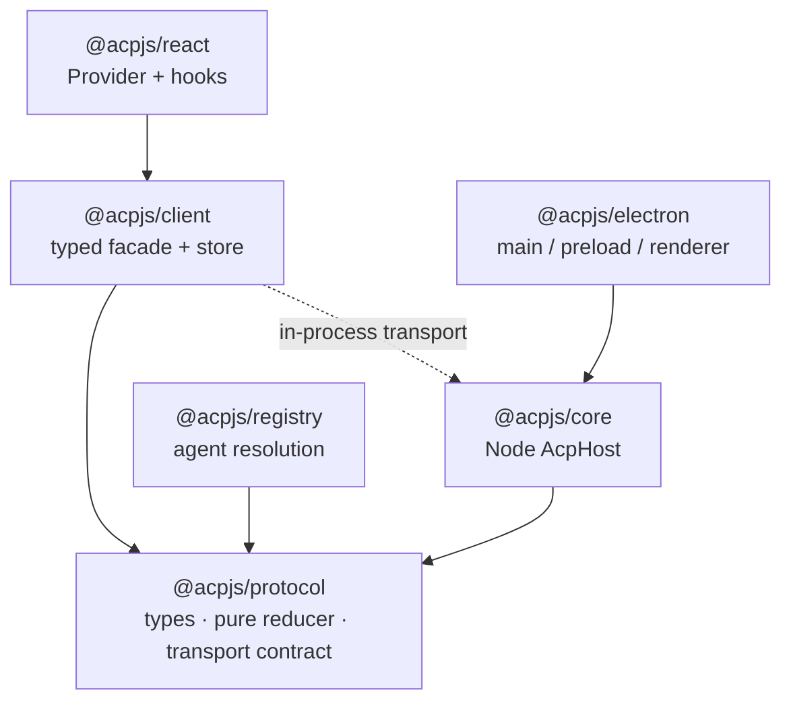

# acpjs

Layered TypeScript **Client** toolkit for the [Agent Client Protocol (ACP)](https://agentclientprotocol.com). Headless — spawns any ACP agent over the official SDK and projects session traffic into a serializable, replayable, typed `SessionState`.

Design rule: **mechanism, not decision.** acpjs owns plumbing (spawn, connection, event normalization, one pure reducer, transport boundary, persist/replay). Every decision ACP leaves open — permission approval, auth, retries, project grouping — is **surfaced, not decided**, and belongs to the integrator. Detail: [docs/design-philosophy.md](./docs/design-philosophy.md), integrator recipes: [docs/recipes.md](./docs/recipes.md).

## Packages

| Package | Role | Entry |
| --- | --- | --- |
| `@acpjs/protocol` | Normalized event model, `SessionState`, pure `reduce`, host transport contract types. Types + pure functions only, environment-neutral. | [README](./packages/protocol/README.md) |
| `@acpjs/core` | Node `AcpHost`: spawns agents, drives the ACP connection, normalizes/numbers events, replays for late subscribers, routes permissions, default fs, opt-in terminal, restart + storage. | [README](./packages/core/README.md) |
| `@acpjs/client` | Typed facade + reducer-driven snapshot/subscribe store over the HostClientTransport contract; built-in in-process transport. | [README](./packages/client/README.md) |
| `@acpjs/react` | `<AcpProvider>` + hooks (`useSession`, `useAgent`, …) on `useSyncExternalStore`. No state-library dependency. | [README](./packages/react/README.md) |
| `@acpjs/electron` | Electron bridge: `/main`, `/preload`, `/renderer` entries that hand off over a `MessageChannelMain` port. | [README](./packages/electron/README.md) |
| `@acpjs/registry` | ACP registry fetch/cache, `AgentDefinition` resolution, `ensureInstalled` (four-tier). | [README](./packages/registry/README.md) |
| `@acpjs/fixture-agent` | **Private.** Scripted protocol-replay agent used as an E2E test fixture. | [README](./packages/fixture-agent/README.md) |

## Architecture

Strict one-directional dependency graph. Solid arrows are package dependencies; the dotted line is a runtime transport link (the client has **no** package dependency on core — only the `@acpjs/protocol` contract types).



Direction enforced: `react → client → protocol`, `electron(main) → core → protocol`, `registry → protocol`. `@acpjs/protocol` is environment-neutral (zero runtime deps). `@acpjs/core` accepts only an `AgentDefinition` (`command`, `args`, `env`, `cwd`, `meta`); hand-written config and registry output are isomorphic — the registry is an optional convenience, never required.

## Quick start

### Node, in-process

```ts
import { createAcpClient, createInProcessTransport } from '@acpjs/client'
import { createAcpHost, createHostEndpoint } from '@acpjs/core'

const host = createAcpHost()
const client = createAcpClient({
  transport: createInProcessTransport(createHostEndpoint(host)),
})

const agent = await client.agents.spawn({
  id: 'my-agent',
  command: 'npx',
  args: ['some-acp-agent'],
})
const session = await agent.sessions.create({
  cwd: process.cwd(),
  mcpServers: [],
  additionalDirectories: [],
})
session.subscribe((state) => console.log(state))
await session.prompt([{ type: 'text', text: 'hello' }])

await client.dispose() // closes transport only
await host.dispose() // reclaim agent child processes
```

### React

```tsx
import { AcpProvider, usePermissionRequests, useSession } from '@acpjs/react'
import type { AcpClient } from '@acpjs/client'

function App({ client, sessionId }: { client: AcpClient; sessionId: string }) {
  return (
    <AcpProvider client={client}>
      <Chat sessionId={sessionId} />
    </AcpProvider>
  )
}

function Chat({ sessionId }: { sessionId: string }) {
  const session = useSession(sessionId)
  const permissions = usePermissionRequests()
  if (!session) return null
  return (
    <>
      {session.state.messages.map((m, i) => <p key={i}>{JSON.stringify(m.content)}</p>)}
      <button onClick={() => void session.prompt([{ type: 'text', text: 'hi' }])}>Send</button>
      {permissions.map((r) => (
        <button key={r.requestId} onClick={() => void r.respond({ outcome: 'selected', optionId: r.options[0]?.optionId ?? '' })}>
          Allow
        </button>
      ))}
    </>
  )
}
```

### Electron

- `/main` — `attachAcpBridge(host)` answers the handshake and opens one `MessageChannelMain` per window.
- `/preload` — `exposeAcp()` exposes `{ connect }` over `contextBridge` (requires `contextIsolation: true`).
- `/renderer` — `electronTransport()` → pass to `createAcpClient`.

### Registry

```ts
import { createRegistryClient } from '@acpjs/registry'
import { createAcpHost } from '@acpjs/core'

const host = createAcpHost()
const definition = await createRegistryClient().ensureInstalled('claude-acp')
await host.spawnAgent(definition)
```

## Key constraints

- **ESM-only, Node ≥ 24.** `protocol`, `client`, `react` are environment-neutral (browser/renderer-safe, no Node built-ins); `core`, `registry`, `electron` are Node/Electron-only.
- **In-process lifetimes are independent.** `client.dispose()` closes the transport only; you **must** also `await host.dispose()` or agent child processes leak.
- **Default storage is in-memory** — nothing is persisted. Inject JSONL storage or a custom `StorageAdapter` for durable history.
- **No raw ACP escape hatch.** There is no way to send raw ACP methods outside the typed public surface.
- **Integrator-owned decisions** (surfaced, not implemented): auth method/timing, permission approval/auto-rules, project grouping, orchestration/queues/retries.
- `plan_update` / `plan_removed` are UNSTABLE — acpjs supports the full plan snapshot but not incremental plan mutation.

## Commands

| Command | Description |
| --- | --- |
| `pnpm build` | Build all packages (`turbo build`). |
| `pnpm test` | Full test suite (`turbo test`). |
| `pnpm typecheck` | Type-check all packages. |
| `pnpm lint` / `pnpm lint:fix` | oxlint. |
| `pnpm format` / `pnpm format:check` | oxfmt. |
| `pnpm check` | Dependency-direction, browser-neutrality, and publish checks. |
| `pnpm clean` | Remove build outputs and caches. |

pnpm workspace (`pnpm ≥ 10`), `workspace:*` internal refs, `tsdown` builds, turborepo orchestration, changesets release.

## License

MIT
